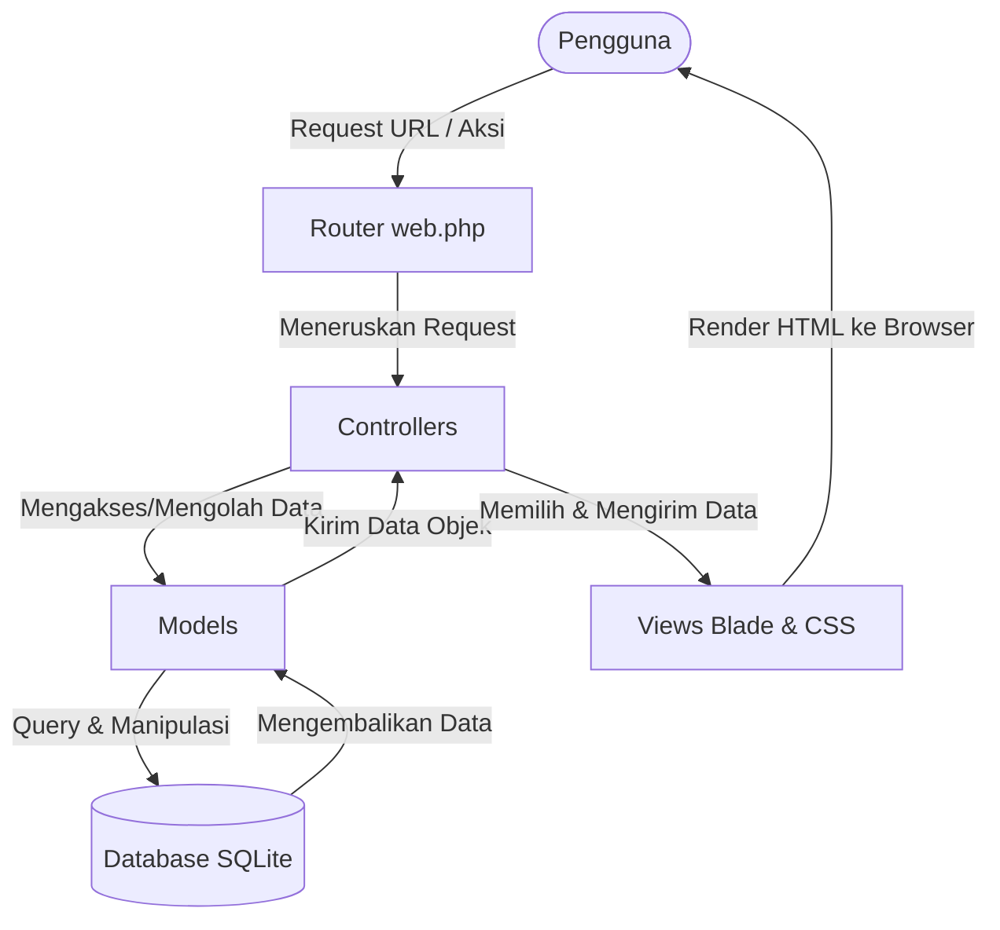

# Diabsen++ (Sistem Absensi Guru Berbasis QR Code)

## 📌 Deskripsi Proyek
**Diabsen++** adalah aplikasi sistem absensi guru berbasis web yang dikembangkan menggunakan framework Laravel. Sistem ini dirancang untuk mempermudah, mengotomatisasi, dan meningkatkan efisiensi proses pencatatan kehadiran guru di sekolah atau instansi pendidikan. 

Pencatatan kehadiran dilakukan menggunakan teknologi **QR Code**, di mana setiap Guru memiliki QR Code unik yang nantinya akan dipindai (scan) oleh Staf **Tata Usaha (TU)** menggunakan scanner berbasis kamera web pada aplikasi. Sistem ini juga dilengkapi dengan manajemen pengajuan izin/sakit bagi Guru, kalender hari libur, pengaturan jam batas masuk, dan pelaporan absensi yang dapat diekspor ke dalam format CSV/Excel oleh TU dan Wakil Kepala Sekolah (Wakasek) Kurikulum.

---

## 🛠️ Persyaratan Sistem & Tech Stack (Requirements)

Untuk menjalankan proyek ini, pastikan sistem Anda memenuhi kebutuhan berikut:

### 1. Teknologi Inti (Core Stack)
*   **Bahasa Pemrograman**: PHP (Minimal versi **8.3** ke atas)
*   **Framework Backend**: Laravel (Versi **13.8.x**)
*   **Database**: SQLite (Default, database file disimpan di `database/database.sqlite`) atau DBMS relational lainnya (MySQL/PostgreSQL) yang didukung oleh Laravel Eloquent.
*   **Frontend bundler & compiler**: Vite (Versi **8.0.0** ke atas)
*   **Framework CSS (Styling)**: Tailwind CSS (Versi **4.0.0** ke atas)
*   **Rendering Template**: Laravel Blade Templating

### 2. Dependensi Composer (`composer.json`)
*   **laravel/framework (^13.8)**: Framework utama PHP untuk mempermudah routing, MVC, dan interaksi database.
*   **laravel/tinker (^3.0)**: Tool REPL untuk berinteraksi dengan database dan testing object secara command-line.
*   **fakerphp/faker (^1.23)**: Digunakan untuk membuat data palsu saat proses development.
*   **phpunit/phpunit (^12.5)**: Framework pengujian unit/integrasi untuk memastikan fungsi berjalan dengan benar.
*   **laravel/pail & laravel/pao**: Logger dan tool pembantu debugging lokal.

### 3. Dependensi NPM (`package.json`)
*   **tailwindcss (^4.0.0)** & **@tailwindcss/vite (^4.0.0)**: Menyediakan utility-first CSS modern yang dicompile secara dinamis menggunakan Vite.
*   **concurrently (^9.0.1)**: Digunakan untuk menjalankan server local Laravel (`php artisan serve`) dan Vite development server (`npm run dev`) secara bersamaan dalam satu command console.
*   **laravel-vite-plugin (^3.1)**: Penghubung aset frontend Laravel dengan Vite bundler.

---

## 📐 Pola Arsitektur MVC (Model-View-Controller)

Proyek **Diabsen++** sepenuhnya menerapkan arsitektur **MVC** standar Laravel untuk memisahkan logika data (Model), tampilan antarmuka (View), dan logika kontrol aplikasi (Controller).

Berikut adalah penjelasan dan pemetaan fungsi masing-masing komponen MVC di dalam aplikasi:



### 1. Model (Data & Logika Bisnis)
Model terletak di folder `app/Models/` dan merepresentasikan struktur tabel database serta relasi antardata.
*   **`User`** (`app/Models/User.php`): 
    *   Merepresentasikan tabel akun pengguna sistem.
    *   Memiliki fungsi helper pengecekan hak akses/peran (`isWakasek()`, `isTu()`, `isGuru()`).
    *   Memiliki relasi satu-ke-satu (`hasOne`) dengan model `Teacher`.
*   **`Teacher`** (`app/Models/Teacher.php`):
    *   Merepresentasikan profil data guru.
    *   Menyimpan informasi unik seperti `nidn`, nama lengkap, nomor telepon, dan `qr_code_token`.
    *   Memiliki relasi satu-ke-banyak (`hasMany`) dengan `Attendance` dan `Leave`.
*   **`Attendance`** (`app/Models/Attendance.php`):
    *   Merepresentasikan log kehadiran harian.
    *   Menyimpan data `check_in` (jam masuk), `status` kehadiran (`hadir`, `terlambat`, `izin`, `sakit`, `alfa`), referensi guru (`teacher_id`), dan operator yang memindai QR (`scan_by_user_id`).
*   **`Leave`** (`app/Models/Leave.php`):
    *   Merepresentasikan data pengajuan izin/sakit oleh guru.
    *   Menyimpan range tanggal (`start_date`, `end_date`), tipe (`izin`/`sakit`), alasan (`reason`), berkas bukti (`proof_file`), dan `status` persetujuan (`pending`, `approved`, `rejected`).
*   **`Holiday`** (`app/Models/Holiday.php`):
    *   Merepresentasikan tanggal libur nasional/sekolah. Digunakan untuk menonaktifkan fitur scan absensi pada hari libur tersebut.
*   **`Setting`** (`app/Models/Setting.php`):
    *   Menyimpan konfigurasi sistem key-value. Contohnya, batas waktu masuk (`time_limit_in` default `07:30`).

---

### 2. Controller (Logika Kontrol & Alur Kerja)
Controller terletak di folder `app/Http/Controllers/` dan berfungsi menjembatani input pengguna dari View untuk kemudian diproses lewat Model dan dikembalikan ke View.

#### A. **`AuthController`** (`app/Http/Controllers/AuthController.php`)
Mengatur proses autentikasi sistem. Menariknya, sistem ini menggunakan metode **Passwordless Login** (login tanpa password) berbasis NIDN atau Username/Email untuk kemudahan akses pengguna:
*   `showLogin()`: Menampilkan halaman form login. Jika pengguna sudah login, otomatis dialihkan ke dashboard masing-masing peran.
*   `login(Request $request)`: Memproses input login. Fungsi ini cerdas mendeteksi:
    *   Jika input adalah angka, dicari berdasarkan `nidn` Guru. Jika cocok, otomatis login ke akun user guru terkait.
    *   Jika input teks biasa/email, dicari berdasarkan `username` atau `email` pada tabel `users`.
*   `logout(Request $request)`: Mengakhiri sesi masuk pengguna, menghapus token sesi, dan mengalihkan kembali ke halaman login.
*   `redirectUser(User $user)`: Fungsi proteksi internal yang mengarahkan user ke dashboard spesifik berdasarkan perannya (Wakasek -> `/wakasek/dashboard`, TU -> `/tu/scanner`, Guru -> `/guru/dashboard`).

#### B. **`GuruController`** (`app/Http/Controllers/GuruController.php`)
Mengatur semua fitur dan halaman khusus untuk peran Guru:
*   `dashboard()`: Mengambil profil guru yang sedang aktif, lalu menampilkan rangkuman status absensi hari ini (apakah sudah scan/hadir/belum).
*   `history()`: Menampilkan tabel riwayat absensi harian dan riwayat pengajuan izin/sakit dengan sistem paginasi (10 item per halaman).
*   `leave()`: Menampilkan form pengajuan izin atau sakit.
*   `storeLeave(Request $request)`: Memproses submit pengajuan izin/sakit. Melakukan validasi input, mengunggah file bukti (PDF/gambar) ke folder `public/uploads/proof_files/` dengan nama unik timestamped, lalu menyimpan record izin baru dengan status default `'pending'`.

#### C. **`TuController`** (`app/Http/Controllers/TuController.php`)
Mengatur tugas operasional Tata Usaha seperti pemindaian kartu/token absensi dan pelaporan:
*   `scanner()`: Menampilkan halaman utama scanner QR Code berbasis kamera (webcam).
*   `scan(Request $request)`: Fungsi API endpoint (diakses via AJAX/Fetch di view) untuk memproses token QR Code hasil scan:
    *   Memvalidasi apakah hari ini weekend (Sabtu/Minggu). Jika iya, scan ditolak.
    *   Memvalidasi apakah hari ini hari libur nasional (pada tabel `holidays`). Jika iya, scan ditolak.
    *   Mengecek keabsahan token QR Code guru.
    *   Memastikan guru bersangkutan belum melakukan absensi hari ini.
    *   Mengecek jam scan saat ini terhadap `time_limit_in` (default `07:30`). Jika melebihi batas waktu tersebut, absensi dicatat dengan status `'terlambat'`, jika tidak maka dicatat sebagai `'hadir'`.
*   `reports(Request $request)`: Menampilkan rekap log absensi seluruh guru dengan fitur filter berdasarkan ID Guru dan rentang tanggal.
*   `export(Request $request)`: Mengekspor data log absensi ke file CSV dengan menambahkan *UTF-8 BOM* agar file dapat terbaca secara rapi dan tidak berantakan saat dibuka di Microsoft Excel.

#### D. **`WakasekController`** (`app/Http/Controllers/WakasekController.php`)
Merupakan controller dengan fungsi terlengkap (Admin) untuk memantau data secara keseluruhan dan melakukan kontrol sistem:
*   `dashboard()`: Menghitung total guru aktif dan menyajikan statistik kehadiran bulanan (persentase hadir, terlambat, izin, sakit, alfa) serta daftar kehadiran hari ini.
*   `teachers()`: Menampilkan daftar data guru terdaftar beserta akun user-nya.
*   `storeTeacher(Request $request)`: Membuat akun user baru (role: guru) sekaligus membuat profil `Teacher` dengan NIDN, nomor telepon, dan otomatis men-generate kode token QR Code unik dengan format `QR_[NIDN]_[RANDOM_STRING]`.
*   `updateTeacher(Request $request, $id)`: Memperbarui data profil guru dan password akun (jika diisi).
*   `destroyTeacher($id)`: Menghapus profil guru sekaligus akun user-nya secara permanen (*Cascade Delete*).
*   `settings()`: Menampilkan halaman konfigurasi jam batas masuk dan daftar hari libur sekolah.
*   `updateSettings(Request $request)`: Memperbarui batas jam masuk guru (`time_limit_in`).
*   `storeHoliday(Request $request)`: Menambahkan tanggal hari libur sekolah baru.
*   `destroyHoliday($id)`: Menghapus hari libur sekolah dari daftar.
*   `leaves()`: Menampilkan seluruh daftar pengajuan izin dan sakit yang diajukan oleh guru.
*   `updateLeaveStatus(Request $request, $id)`: Memproses persetujuan (approval) izin:
    *   Jika status diubah menjadi **`approved`** (disetujui), sistem secara otomatis membuat log record absensi baru di tabel `attendances` untuk setiap hari dalam rentang tanggal izin tersebut (tidak termasuk hari sabtu/minggu/libur nasional) dengan status sesuai tipe izin (`izin`/`sakit`).
    *   Jika status diubah menjadi **`rejected`** (ditolak), sistem akan menghapus log absensi izin/sakit pada tanggal tersebut (jika sebelumnya pernah terbuat).
*   `reports(Request $request)`: Menampilkan filter dan daftar laporan absensi guru untuk dipantau oleh Wakasek.

---

### 3. View (Antarmuka Pengguna)
View terletak di folder `resources/views/` dan membagi interface berdasarkan otorisasi peran pengguna:
*   **`auth/`**: Halaman login yang bersih dan modern.
*   **`guru/`**: Halaman dashboard personal, riwayat kehadiran harian, dan formulir pengajuan izin/sakit (lengkap dengan file uploader).
*   **`tu/`**:
    *   `scanner.blade.php`: Halaman interaktif yang memicu kamera web komputer untuk melakukan pemindaian (scan) QR Code secara realtime.
    *   `reports.blade.php`: Laporan dan filter data absensi bagi staf TU.
*   **`wakasek/`**:
    *   `dashboard.blade.php`: Tampilan analitis dengan bagan persentase kehadiran guru.
    *   `teachers.blade.php`: Halaman CRUD data guru (Tambah, Edit, Hapus) menggunakan modal interaktif.
    *   `settings.blade.php`: Form edit jam batas masuk dan tabel kelola hari libur.
    *   `leaves.blade.php`: Daftar approval dokumen pengajuan izin guru (lengkap dengan link review file bukti).
    *   `reports.blade.php`: Halaman rekap kehadiran komprehensif bagi Wakasek.

---

### 4. Routing (Alur Navigasi & Middleware)
Routing didefinisikan pada `routes/web.php` dan dilindungi oleh Middleware untuk mencegah bypass hak akses:
*   **Bebas Akses (Guest)**: Route login (`/login`)
*   **Middleware `role:guru`**: Grup route `/guru/*` hanya bisa diakses oleh akun guru.
*   **Middleware `role:tu`**: Grup route `/tu/*` hanya bisa diakses oleh staf TU (misal: halaman scanner dan ekspor laporan).
*   **Middleware `role:wakasek`**: Grup route `/wakasek/*` hanya bisa diakses oleh Wakasek Kurikulum.

---

## 💾 Struktur Skema Database (Database Schema)

Berikut adalah ringkasan struktur kolom penting dalam database untuk referensi penulisan Bab IV Skripsi:

1.  **`users`**:
    *   `id` (Primary Key, integer auto-increment)
    *   `name` (Nama User, varchar)
    *   `username` (Username unik/NIDN untuk login, varchar)
    *   `email` (Email unik, varchar)
    *   `role` (Enum: `wakasek`, `tu`, `guru`)
    *   `password` (Hash sandi, varchar)
    *   `timestamps` (`created_at` & `updated_at`)
2.  **`teachers`**:
    *   `id` (Primary Key, integer auto-increment)
    *   `user_id` (Foreign Key -> `users.id`, onDelete cascade)
    *   `nidn` (NIDN unik, varchar)
    *   `name` (Nama lengkap guru, varchar)
    *   `phone_number` (Nomor telepon guru, varchar, nullable)
    *   `qr_code_token` (Token unik penanda QR Code guru, varchar)
    *   `timestamps` (`created_at` & `updated_at`)
3.  **`attendances`**:
    *   `id` (Primary Key, integer auto-increment)
    *   `teacher_id` (Foreign Key -> `teachers.id`, onDelete cascade)
    *   `scan_by_user_id` (Foreign Key -> `users.id`, pencatat absensi/staf TU, nullable, onDelete set null)
    *   `date` (Tanggal absen, date)
    *   `check_in` (Waktu pemindaian/masuk, time, nullable)
    *   `status` (Enum: `hadir`, `terlambat`, `izin`, `sakit`, `alfa`)
    *   `notes` (Catatan tambahan/alasan izin, text, nullable)
    *   `timestamps` (`created_at` & `updated_at`)
4.  **`leaves`**:
    *   `id` (Primary Key, integer auto-increment)
    *   `teacher_id` (Foreign Key -> `teachers.id`, onDelete cascade)
    *   `start_date` (Tanggal mulai izin, date)
    *   `end_date` (Tanggal selesai izin, date)
    *   `type` (Enum: `izin`, `sakit`)
    *   `reason` (Alasan tertulis, text)
    *   `proof_file` (Path file bukti yang diunggah, varchar)
    *   `status` (Enum: `pending`, `approved`, `rejected`, default `pending`)
    *   `timestamps` (`created_at` & `updated_at`)
5.  **`holidays`**:
    *   `id` (Primary Key, integer auto-increment)
    *   `date` (Tanggal libur unik, date)
    *   `name` (Nama libur/Keterangan, varchar)
    *   `timestamps` (`created_at` & `updated_at`)
6.  **`settings`**:
    *   `id` (Primary Key, integer auto-increment)
    *   `key` (Nama kunci pengaturan unik, varchar, contoh: `time_limit_in`)
    *   `value` (Nilai pengaturan, varchar, contoh: `07:30`)
    *   `description` (Keterangan fungsi pengaturan, varchar, nullable)
    *   `timestamps` (`created_at` & `updated_at`)

---

## 🚀 Cara Menjalankan Proyek di Lokal (Setup & Installation)

Ikuti panduan berikut ini jika Anda baru saja mengunduh proyek ini dalam bentuk **file ZIP** dari GitHub atau melakukan **git clone**:

### 📋 Prasyarat Sistem
Sebelum memulai, pastikan komputer Anda telah terinstal:
* **PHP** (Minimal versi 8.3)
* **Composer** (Dependency manager untuk PHP)
* **Node.js & NPM** (Untuk mengelola aset frontend dan Tailwind CSS)
* Server lokal seperti **Laragon** (sangat disarankan) atau **XAMPP**.

---

### 🛠️ Langkah-Langkah Instalasi (Dari Awal/ZIP)

#### 1. Ekstrak File Proyek
Ekstrak file `.zip` proyek ini ke dalam direktori server lokal Anda (misalnya di `C:/laragon/www/diabsen` atau `C:/xampp/htdocs/diabsen`).

#### 2. Buka Terminal / Command Prompt
Buka terminal (Git Bash, Command Prompt, atau PowerShell) dan arahkan ke direktori proyek tersebut:
```bash
cd nama-folder-ekstraksi
```

#### 3. Instal Dependensi PHP (Composer)
Unduh seluruh library/packages PHP yang dibutuhkan oleh Laravel:
```bash
composer install
```

#### 4. Buat File Konfigurasi `.env`
Salin file konfigurasi contoh `.env.example` menjadi file `.env` utama:
* **Windows (Command Prompt / CMD)**:
  ```cmd
  copy .env.example .env
  ```
* **Windows (PowerShell)**:
  ```powershell
  Copy-Item .env.example .env
  ```
* **Linux / macOS / Git Bash**:
  ```bash
  cp .env.example .env
  ```

#### 5. Generate Application Key (Kunci Enkripsi)
Generate kunci keamanan unik untuk aplikasi Anda:
```bash
php artisan key:generate
```

#### 6. Buat Database SQLite
Secara default, proyek ini menggunakan **SQLite** agar lebih praktis tanpa perlu setting MySQL. Anda hanya perlu membuat file database kosong bernama `database.sqlite` di dalam folder `database/`:
* **Windows (PowerShell)**:
  ```powershell
  New-Item database/database.sqlite -ItemType File
  ```
* **Linux / macOS / Git Bash**:
  ```bash
  touch database/database.sqlite
  ```
*(Catatan: Jika Anda menggunakan Laragon atau file explorer biasa, Anda juga bisa langsung klik kanan -> New File di dalam folder `database/` lalu beri nama `database.sqlite`)*

#### 7. Jalankan Migrasi & Seeder Database
Buat seluruh tabel di database dan isi data awal (akun Wakasek, TU, dan data guru default):
```bash
php artisan migrate --seed
```

#### 8. Instal Dependensi Frontend (NPM)
Instal seluruh library Javascript dan CSS (termasuk Tailwind CSS dan Vite):
```bash
npm install
```

#### 9. Build Aset Frontend
Lakukan kompilasi file CSS/JS menggunakan Vite agar tampilan render dengan benar:
* **Mode Development (Hot-Reloading)**:
  ```bash
  npm run dev
  ```
* **Mode Production (Permanen)**:
  ```bash
  npm run build
  ```

#### 10. Jalankan Aplikasi
Nyalakan server Laravel lokal untuk mulai mengakses web:
```bash
php artisan serve
```

---

### 🌐 Akses Aplikasi
Buka web browser pilihan Anda, kemudian kunjungi alamat:
* **`http://localhost:8000`** atau **`http://127.0.0.1:8000`**

---

### 🔑 Akun Default untuk Pengujian (Seeded Accounts)
Gunakan akun uji coba berikut untuk masuk ke sistem (password untuk seluruh akun adalah **`password`**):

* **Wakasek Kurikulum** (Memantau grafik statistik, manajemen guru/akun, hari libur, jam masuk, persetujuan izin):
  * Username / Email: `wakasek` (atau `wakasek@diabsen.com`)
* **Staf Tata Usaha (TU)** (Melakukan scan QR Code kehadiran guru, melihat report, ekspor CSV):
  * Username / Email: `tu` (atau `tu@diabsen.com`)
* **Guru Contoh 1** (Melihat absensi pribadi, mengajukan izin/sakit):
  * Username / NIDN: `198203152010121001` (Nama: Budi Santoso, M.Pd)
  * Token QR Code: `QR_BUDI_19820315`
* **Guru Contoh 2**:
  * Username / NIDN: `198907242015042002` (Nama: Siti Aminah, S.Pd)
  * Token QR Code: `QR_SITI_19890724`
